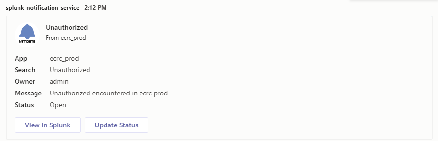

[](https://codeclimate.com/github/SierraSystems/ntt-data-notification-service/test_coverage) [](https://codeclimate.com/github/SierraSystems/ntt-data-notification-service/maintainability)

# ntt-data-notification-service

A Service that pushes notifications to different chat platforms.

Currently, this application supports Splunk as an alert source, and MSTeams and RocketChat as notification destinations.

Teams notification screenshot:



## Usage

In order to use this application, a client requires a token (set in the applications env), and webHook URL(s) for supported chat apps.

### URL Generation

Once a token has been added/provided, navigate to the notification service (if running locally via docker `http://localhost:7080/alert`)


Enter the provided token and the webHook url(s) notifications should be sent to. Click `Generate URL` to create a url containing the information required by the service to post to the provided webHook url(s). This URL will need to be regenerated and updated in Splunk when a chat destination needs to be added or removed. (If running locally via docker, the `localhost:port` part of the url will need to be changed to `172.20.0.6:8080`)

### Splunk WebHook Setup

The URL generated in the frontend is required to setup alerts in Splunk.

Use the following steps to set up a test alert:

1. Navigate to your Splunk instance and log in (if running locally via docker `http://localhost:7000`, with username/password of admin/TestTest).

2. To try out an example log, type the following as a search in Splunk:
```bash
index=_audit  action=search
| eval message = "Insert action required for error"
| table message source info
```

3. Click <b>Save As</b> and select <b>Alert</b>.

4. Provide a title, set it to run on a cron schedule and provide a valid cron expression as per your frequency needs. See below for more information on alert setup.


5. Add actions:
```
Webhook
Add to Triggered Alerts
```


6. In the Webhook action, paste in the URL generated by the frontend.

7. Press <b>Save</b>.

8. Click <b>View Alert</b>.

<b>NOTE:</b> Make sure to remove this alert once done testing as it is only intended for ensuring connectivity between Splunk, the notification service, and the chat platform(s).


## Running Locally via Docker

To run the application locally with Docker, a `.env` file will need to be created. See the `.env.example` file for variables used by this application.

```bash
docker-compose up --build
```

This should spin up the ntt-data-notification-service and the latest docker image of Splunk locally.

To modify the ports the app is running on, simply change the port mappings in the docker-compose file.

## Splunk Alert

Basic information about setting up alerts for use with the Notification Service.

### Alert Search Fields

There are several standard and custom fields used to create notifications.

```bash
index=<application_logs_to_search>  <search_criteria>
| eval message = "<action_to_be_taken>"
| eval dashboard = "<link_to_dashboard>"
| table source message dashboard <other>
```

Fields provided automatically by Splunk:
- sid: A search ID, not currently used
- searchName: The name given to the alert when created
- owner: The user who initially created the alert
- results_link: A link back to the alert query in Splunk

Custom fields added to improve notification usability:
- source: Source of the logs which produced the alert, used as App in notifications
- message: A custom message for each alert indicating what should be done in response to the alert
- dashboard: A link back to a Splunk dashboard associated with the application
- <other>: The Notification Service will add any other fields in the table to the created notification

### Alert Settings

When creating an alert there are a number of important fields.

Time Range: When running a scheduled alert, this refers to the time range to use for the search associated with the alert. It should closely match the scheduled alert time, eg. if an alert runs every hour, the Time Range should be 1 hour but if the alert runs once a day, the Time Range should be 24 hours.

Cron Expression: Cron expressions are used for more fine-tuned alert scheduling. See [freeformatter.com](https://www.freeformatter.com/cron-expression-generator-quartz.html)

Expires: This refers to how long an alert is displayed if it triggered, and not how long the alert itself is valid.

Trigger Conditions: These can be used to set some additional behavior on alerts, such as how many events have to occur before an alert is triggered, if an alert should trigger once or once for each result, how much time should elapse before an alert can trigger again. 

## Debugging

Useful tools for testing implementation and debugging issues.

### Postman

There is a postman collection and environment included in the [test folder](https://github.com/SierraSystems/ntt-data-notification-service/tree/master/src/test/postman). This collection can be used to test and confirm the implementation of the notification service.

### Splunk webHook Logs

The following search can be used to check the Splunk webHook logs for connection issues with the Notification Service

```bash
index=_internal sourcetype=splunkd component=sendmodalert action="webhook"
```
